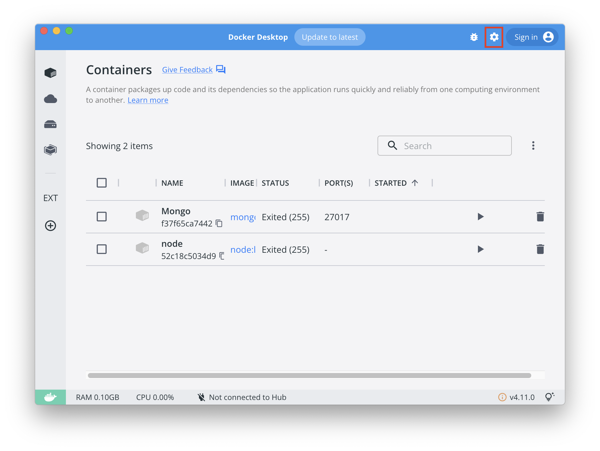
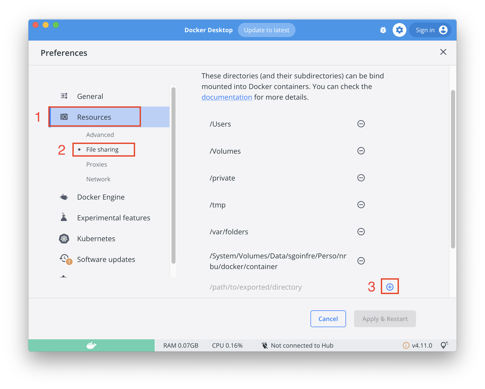

# 42_docker

## Configuración docker entorno 42 Barcelona

Comprobar espacio usuario

	du -d0 -h ~/

Se necesita tener usuados menos de 3.5Gb

## Liberar espacio

	rm -Rf ~/.docker
	rm -Rf ~/Library/Containers/com.docker.docker
	rm -Rf ~/Library/Application\ Support/Docker\ Desktop
	rm -Rf ~/Library/Group\ Containers/group.com.docker
	rm -f ~/Library/HTTPStorages/com.docker.docker.binarycookies
	rm -Rf ~/Library/Logs/Docker\ Desktop
	rm -f ~/Library/Preferences/com.docker.docker.plist
	rm -Rf ~/Library/Saved\ Application\ State/com.electron.docker-frontend.savedState
	rm -f ~/Library/Preferences/com.electron.docker-frontend.plist

Desistalar Docker desde  **"Manager Software Centre"**

Salir sesión mac

Instalar Docker desde **"Manager Software Centre"**

## Copiar ***"Data"*** Docker

Para tener persisrencia de las imagenes, los contenedores y los volumenes es necesario copiar la carpeta ***Data*** a la unidad personal que disponemos en ***sgoinfre***

`/Users/<User_42>/Library/Containers/com.docker.docker/Data`

	cp /Users/<User_42>/Library/Containers/com.docker.docker/Data sgoinfre/Perso/<User_42>/Docker/

## Borrar ***"Data"*** Docker

Nesecitasmos borrar la carpeta ***Data*** de origen para poder realizar el enlance a nuestra carpeta personal ***Data*** copiada con anterioridad en ***sgoinfre***

	rm -rf /Users/<User_42>/Library/Containers/com.docker.docker/Data

## Hacer enlace simbolico

	ln -s sgoinfre/Perso/<User_42>/Docker/ Data

coprobar 

	ls -la

## Iniciar Docker

Se ejecuta correctamente ...!!!

## Asignar directorio para container de intercambio

***Settings*** Docker

Docker ***Resources***, **File Sharing**

Añadir una carpeta dentro de la unidad personal de ***sgoinfre*** donde estaran los datos compartidos entre los contenedores de Docker y el host main.

## Iniciar Docker

**Nota**
	Al iniciarse Docker es importante no hacer click, hasta que el mensaje de "Docker Desktop stating" desapareza.

## Descargar images 

### [Images Docker](https://hub.docker.com/)